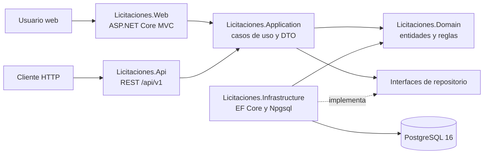

# Arquitectura general

## Alcance de la Iteración 1

La solución usa .NET 9 y separa dominio, casos de uso, persistencia y entradas HTTP. El incremento ejecutable de la Iteración 1 es la gestión de proveedores: registro, edición, baja lógica, listado y consulta desde MVC y API REST.

También existe un modelo base persistente para licitaciones, ofertas, niveles de aprobación, estados y tipos de cambio. En esta iteración esos módulos no tienen casos de uso, controladores ni vistas; por tanto no se consideran funcionalidad terminada.

## Proyectos y dependencias

| Proyecto | Responsabilidad comprobada |
| --- | --- |
| `Licitaciones.Domain` | Entidades, validación y normalización; no depende de ASP.NET Core ni de EF Core. |
| `Licitaciones.Application` | Servicios de crear, consultar, editar y dar de baja proveedores; DTO e interfaces de persistencia. |
| `Licitaciones.Infrastructure` | `LicitacionesDbContext`, configuraciones Fluent API, migraciones, repositorio y reloj del sistema. |
| `Licitaciones.Web` | Controlador y vistas Razor para el CRUD lógico de proveedores. Aplica migraciones al iniciar. |
| `Licitaciones.Api` | Controlador REST versionado de proveedores y respuestas HTTP. No aplica migraciones al iniciar. |

Web y API registran los servicios por inyección de dependencias. Ambos reutilizan Application y Domain, evitando repetir reglas en los controladores.

## Decisiones implementadas

- PostgreSQL se accede mediante EF Core 9 y Npgsql.
- Los nombres de proveedores se normalizan en Domain y la unicidad se refuerza con un índice parcial en PostgreSQL.
- `xmin` funciona como token de concurrencia optimista para edición.
- `DeletedAt` y un filtro global implementan la baja lógica.
- `IClock` permite controlar el tiempo en pruebas.
- Web usa antifalsificación en operaciones POST. La API usa DTO de entrada y devuelve `ProblemDetails` en los errores controlados implementados.
