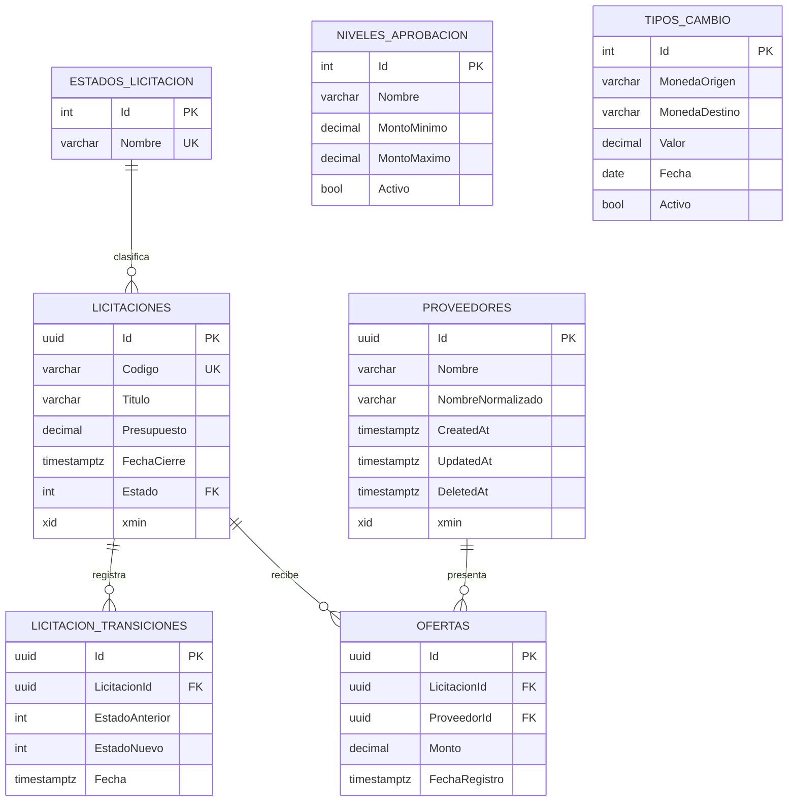

# Modelo de datos

El modelo ejecutable está definido por `LicitacionesDbContext`, las configuraciones Fluent API y cuatro migraciones: `CreateProviders`, `CompleteInitialDomain`, `AddProveedorSoftDelete` e `ImplementCreateTenderHu10`/`ImplementPublishTenderHu11`. La migración `AdministrarNivelesAprobacionHu18` agrega la columna `Activo` de niveles de aprobación y su secuencia de identificadores. La migración `AddLicitacionConcurrencyToken` (HU-29) agrega a `Licitaciones` el token de concurrencia optimista `xmin`.

## Proveedores

| Columna | Tipo PostgreSQL | Regla |
| --- | --- | --- |
| `Id` | `uuid` | Clave primaria; Guid generado por Domain. |
| `Nombre` | `varchar(200)` | Obligatorio; forma legible normalizada. |
| `NombreNormalizado` | `varchar(200)` | Obligatorio; forma comparable. |
| `CreatedAt` | `timestamp with time zone` | Obligatorio; asignado al insertar. |
| `UpdatedAt` | `timestamp with time zone` | Obligatorio; actualizado al modificar. |
| `DeletedAt` | `timestamp with time zone` | Nullable; indica baja lógica. |
| `xmin` | `xid` | Token de concurrencia administrado por PostgreSQL. |

El índice parcial único `UX_Proveedores_NombreNormalizado`, filtrado por `"DeletedAt" IS NULL`, impide dos proveedores activos equivalentes y permite reutilizar el nombre de uno dado de baja. El filtro global de EF Core excluye por defecto las filas con `DeletedAt`.

## Licitaciones

| Columna | Tipo PostgreSQL | Regla |
| --- | --- | --- |
| `Id` | `uuid` | Clave primaria; Guid generado por Domain. |
| `Codigo` | `varchar(50)` | Obligatorio; forma legible. |
| `CodigoNormalizado` | `varchar(50)` | Obligatorio; `Trim().ToUpperInvariant()`, índice único parcial filtrado por `DeletedAt IS NULL`. |
| `Titulo` | `varchar(250)` | Obligatorio. |
| `Presupuesto` | `numeric(18,2)` | Obligatorio; restricción CHECK `> 0`. |
| `FechaCierre` | `timestamp with time zone` | Obligatorio. |
| `Estado` | `integer` | FK hacia `EstadosLicitacion`. |
| `CreatedAt` | `timestamp with time zone` | Obligatorio; asignado al insertar. |
| `UpdatedAt` | `timestamp with time zone` | Obligatorio; actualizado al modificar. |
| `DeletedAt` | `timestamp with time zone` | Nullable; indica baja lógica. |
| `xmin` | `xid` | Token de concurrencia optimista (HU-29); ante dos actualizaciones concurrentes sobre la misma fila, la segunda lanza `DbUpdateConcurrencyException`. |

## LicitacionTransiciones

| Columna | Tipo PostgreSQL | Regla |
| --- | --- | --- |
| `id` | `uuid` | Clave primaria; Guid generado por Domain. |
| `licitacion_id` | `uuid` | FK hacia `Licitaciones` con cascade. |
| `estado_anterior` | `integer` | Estado previo a la transición. |
| `estado_nuevo` | `integer` | Estado resultante de la transición. |
| `fecha` | `timestamp with time zone` | Momento de la transición. |

Registra cada cambio de estado de una licitación. La FK con cascade elimina
las transiciones al eliminar la licitación. Se persiste mediante
`LicitacionTransicion.Crear(...)` invocado desde `Licitacion.Publicar(...)`.

## Ofertas

| Columna | Tipo PostgreSQL | Regla |
| --- | --- | --- |
| `Id` | `uuid` | Clave primaria; Guid generado por Domain. |
| `LicitacionId` | `uuid` | FK restrictiva hacia `Licitaciones`. |
| `ProveedorId` | `uuid` | FK restrictiva hacia `Proveedores`. |
| `Monto` | `numeric(18,2)` | Obligatorio; restricción CHECK `CK_Ofertas_Monto_Positivo` (`> 0`). |
| `FechaRegistro` | `timestamp with time zone` | Momento obtenido mediante `IClock`. |
| `CreatedAt` | `timestamp with time zone` | Obligatorio; asignado al insertar. |
| `UpdatedAt` | `timestamp with time zone` | Obligatorio; actualizado al modificar. |

El índice único compuesto `IX_Ofertas_LicitacionId_ProveedorId` garantiza una
sola oferta por proveedor y licitación, incluso ante registros concurrentes.
El límite de la oferta respecto al presupuesto y la admisión por estado o
fecha son reglas del caso de uso; no son restricciones de base de datos.

## NivelesAprobacion

| Columna | Tipo PostgreSQL | Regla |
| --- | --- | --- |
| `Id` | `integer` | Clave primaria; valor por defecto desde la secuencia `NivelesAprobacion_Id_seq`, iniciada en 4 tras las semillas. |
| `Nombre` | `varchar(100)` | Obligatorio. |
| `MontoMinimo` | `numeric(18,2)` | CHECK `CK_NivelesAprobacion_Minimo` (`>= 0`). |
| `MontoMaximo` | `numeric(18,2)` | Nullable; CHECK `CK_NivelesAprobacion_Rango` (`MontoMaximo IS NULL OR MontoMaximo > MontoMinimo`). |
| `Activo` | `boolean` | Por defecto `true`; filtra tanto la restricción de exclusión como la resolución del aprobador. |
| `CreatedAt` / `UpdatedAt` | `timestamp with time zone` | Auditoría asignada por el contexto. |

La restricción de exclusión `EX_NivelesAprobacion_SinTraslape` usa
`EXCLUDE USING gist (numrange("MontoMinimo", "MontoMaximo", '[)') WITH &&)`
con `WHERE ("Activo")`: impide dos niveles activos con rangos que se
traslapen, incluido un segundo rango abierto, y fue recreada por
`AdministrarNivelesAprobacionHu18` para aplicar ese filtro.

## Estado funcional del modelo

- `EstadosLicitacion`: catálogo único con Borrador, Publicada, Cerrada, Adjudicada y Cancelada.
- `Licitaciones`: código único, título de hasta 250 caracteres, presupuesto `numeric(18,2)` positivo, cierre, estado y auditoría. Crear, publicar, editar y cierre funcional implementados (HU-10, HU-11, HU-12). HU-29 añadió el token de concurrencia optimista `xmin` mediante la migración `AddLicitacionConcurrencyToken`.
- `LicitacionTransiciones`: historial de cambios de estado de licitaciones (HU-11).
- El mismo historial registra el cierre manual `Publicada -> Cerrada` de HU-12;
  no fue necesario cambiar el esquema ni crear una migracion adicional.
- `Ofertas`: registro mediante API implementado en HU-14; relaciones restrictivas, monto positivo y unicidad por `(LicitacionId, ProveedorId)`.
- `NivelesAprobacion`: límites `numeric(18,2)`, columna `Activo` y semillas Operativo, Gerencial y Directivo. Contiene checks de mínimo y rango, además de la restricción de exclusión `EX_NivelesAprobacion_SinTraslape`, recreada por la migración `AdministrarNivelesAprobacionHu18` con filtro `WHERE ("Activo")`. HU-18 expone la creación y la resolución del aprobador; editar, listar y desactivar no están implementados todavía.
- `TiposCambio`: valor `numeric(18,6)` positivo, fecha, indicador activo, índice único parcial sobre el registro activo y semilla USD/CRC con valor 500. HU-19 administra el registro activo por API (guardar desactiva el previo) y lo consume para la conversión de presentación de ofertas; no agregó migraciones ni cambió el esquema.

Las entidades auditables reciben `CreatedAt` y `UpdatedAt` desde `LicitacionesDbContext` mediante `IClock`.
