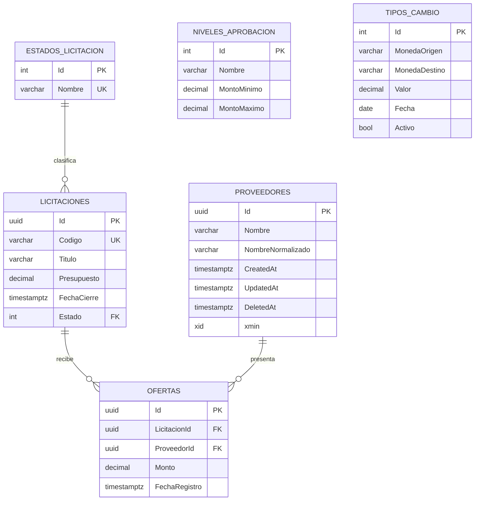

# Modelo de datos

El modelo ejecutable está definido por `LicitacionesDbContext`, las configuraciones Fluent API y tres migraciones: `CreateProviders`, `CompleteInitialDomain` y `AddProveedorSoftDelete`.

## Proveedores

| Columna | Tipo PostgreSQL | Regla |
| --- | --- | --- |
| `Id` | `uuid` | Clave primaria; Guid generado por Domain. |
| `Nombre` | `varchar(200)` | Obligatorio; forma legible normalizada. |
| `NombreNormalizado` | `varchar(200)` | Obligatorio; forma comparable. |
| `CreatedAt` | `timestamp with time zone` | Obligatorio; asignado al insertar. |
| `UpdatedAt` | `timestamp with time zone` | Obligatorio; actualizado al modificar. |
| `DeletedAt` | `timestamp with time zone` | Nullable; indica baja lógica. |
| `xmin` | `xid` | Token de concurrencia administrado por PostgreSQL. |

El índice parcial único `UX_Proveedores_NombreNormalizado`, filtrado por `"DeletedAt" IS NULL`, impide dos proveedores activos equivalentes y permite reutilizar el nombre de uno dado de baja. El filtro global de EF Core excluye por defecto las filas con `DeletedAt`.

## Modelo base aún sin interfaz funcional

- `EstadosLicitacion`: catálogo único con Borrador, Publicada, Cerrada, Adjudicada y Cancelada.
- `Licitaciones`: código único, título de hasta 250 caracteres, presupuesto `numeric(18,2)` positivo, cierre, estado y auditoría.
- `Ofertas`: relaciones restrictivas con licitación y proveedor, monto `numeric(18,2)` positivo y unicidad por `(LicitacionId, ProveedorId)`.
- `NivelesAprobacion`: límites `numeric(18,2)` y semillas Operativo, Gerencial y Directivo. Contiene checks de mínimo y rango, además de la restricción de exclusión `EX_NivelesAprobacion_SinTraslape` creada por la migración `CompleteInitialDomain`.
- `TiposCambio`: valor `numeric(18,6)` positivo, fecha, indicador activo, índice único parcial sobre el registro activo y semilla USD/CRC con valor 500.

Las entidades auditables reciben `CreatedAt` y `UpdatedAt` desde `LicitacionesDbContext` mediante `IClock`.
